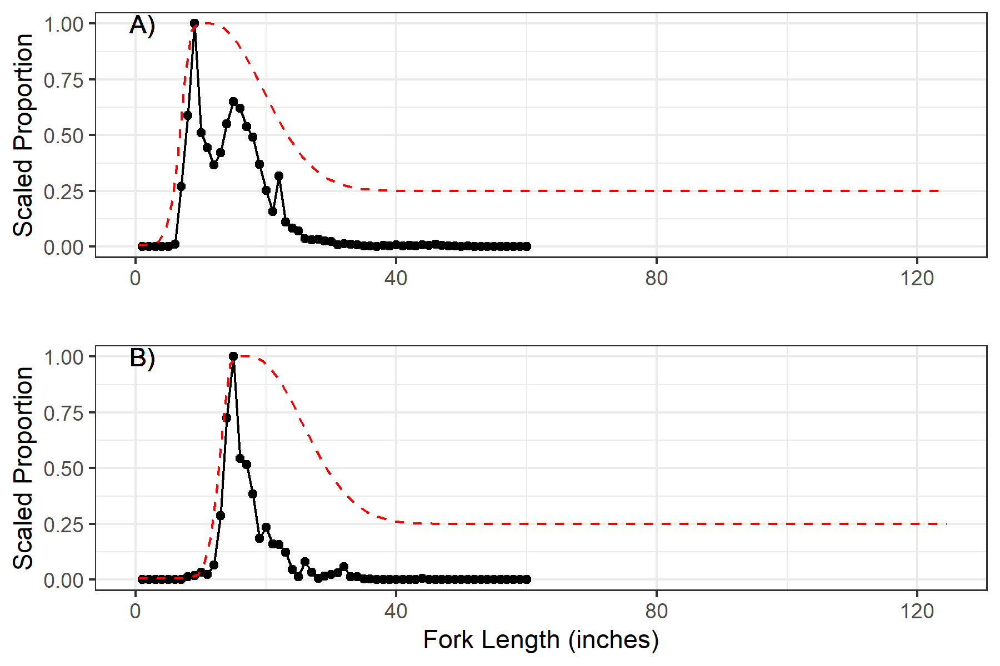

```{r ssfiles-read, }

# get out put SSS model that doesn't change between models - natural mortality,
# growth, length-weight relationship, etc. 

ss_out <- SS_output("SSmodels/sss",
                           verbose = FALSE,
                           covar = FALSE,
                           printstats = FALSE)

```


```{r ssfiles-data, }

# Get data needed for plots of biological stuff

m_by_age <- 
  ss_out$Natural_Mortality_Bmark %>%
  select(-c(Bio_Pattern, Sex, Settlement, Seas)) %>%
  pivot_longer(everything(), names_to = "Age", values_to = "M")

# only need first row of ss_out$growthseries because growth constant over time
# so every row (year) will have size for a given age
growth <-
  ss_out$growthseries[1,] %>%
  select(-c(Morph, Yr, Seas, SubSeas)) %>%
  pivot_longer(everything(), names_to = "Age", values_to = "Length") %>%
  mutate(Length_Upper = Length + 2*(Length*0.1),
         Length_Lower = Length - 2*(Length*0.1))


# length-weight relationship
b <- 2.8977

# have to adjust a value for change in units (mm to cm and g to kg)
a <- 0.0000318/(1000*(0.1)^(b))

lengths <- seq(from = 0, to = 200, by = 1)
weight <- a*(lengths)^(b)

lw_dat <- data.frame(length = lengths, weight = weight)

```

```{r ssfiles-plot, fig.height = 7, fig.width = 4}

m_by_age_plot <-
  ggplot(m_by_age, aes(x = as.numeric(Age), y = M)) +
  geom_point() +
  geom_line() +
  labs(x = "Age (yr)",
       y = "Natural Mortality") +
  scale_y_continuous(limit = c(0,0.5)) +
  theme_bw()

growth_plot <-
  ggplot(growth, aes(x = as.numeric(Age), y = Length)) +
  geom_ribbon(aes(ymin = Length_Lower, ymax = Length_Upper), fill = "grey70") +
  geom_line() +
  # ylim(c(0, 200)) +
  labs(x = "Age (yr)",
       y = "Length (cm)") +
  theme_bw()

lw_plot <-
  ggplot(lw_dat, aes(x = length, y = weight)) +
  geom_line() +
  labs(y = "Weight (kg)",
       x = "Length (cm)") +
  theme_bw()

plot_grid(m_by_age_plot, 
          growth_plot,
          lw_plot,
          ncol = 1
          #align = "v",
          #labels = c("A", "B", "C")
          )


```


`r figure("biologypar-plot", caption = "Age-specific natural mortality, von Bertalanffy growth model, and length-weight relationship used in both Stock Synthesis models that were developed as part of the 2022 black drum benchmark stock assessment. ")`


```{r removals-plot, }

# from: 
# https://stackoverflow.com/questions/34533472/insert-blanks-into-a-vector-for-e-g-minor-tick-labels-in-r/34533473#34533473

every_nth <- function(x, nth, empty = TRUE, inverse = FALSE) 
  {
  if (!inverse) {
    if(empty) {
      x[1:nth == 1] <- ""
      x
      } else {
        x[1:nth != 1]
        }
    } else {
      if(empty) {
        x[1:nth != 1] <- ""
        x
        } else {
          x[1:nth == 1]
        }
    }
}


custom_breaks <- seq(from = 1900, to = 2020, by = 5)

ggplot(TotalRemovals, aes(x = year, y = catch)) +
  #geom_point(shape = 21, col = "black", fill = "grey50") +
  geom_bar(stat="identity", width = 1) +
  #geom_errorbar(aes(ymin=obs-(se_log*2), ymax=obs+(se_log*2)), width=.2) +
  theme_bw() +
  #scale_x_continuous(minor_breaks = seq(from = 1900, to = 2020, by = 5)) +
    scale_x_continuous(breaks = custom_breaks,
                     labels = every_nth(custom_breaks, 4, inverse = TRUE)) + 
  labs(y = "Total Removals (mt)",
       x = "") #+
  #scale_y_continuous(lim = c(0, 0.5))

```

`r figure("totalremovals-plot", caption = "Total coastwide removals of black drum during 1900-2020.")`


`r run_pagebreak()`


`r figure("selectivity-plot", caption = "Length specific selectivity curves for two different time periods that were used in the Simple Stock Synthesis model that was developed as part of the 2022 black drum benchmark stock assessment.")`


`r run_pagebreak()`

```{r MRIPCPUE-plot, }

ggplot(MRIPCPUE, aes(x = year, y = obs)) +
  geom_point() +
  geom_errorbar(aes(ymin=obs-(se_log*2), ymax=obs+(se_log*2)), width=.2) +
  theme_bw() +
  labs(y = "MRIP CPUE",
       x = "") +
  scale_y_continuous(lim = c(0, 0.5))

```

`r figure("MRIPCPUE-plot", caption = "MRIP CPUE index of abundance. Error bars are proportional standard errors.")`

\newpage

```{r lengthcomp1-plot, fig.height = 7, fig.width = 6}

# length_data <- ss_v01_02[["lendbase"]]

lengthcomp1_dn_data <- subset(length_data_dn, Yr %in% c(1982:2005))

lengthcomp1_dn_plot <- 
  ggplot(lengthcomp1_dn_data, aes(x = Bin, y = Obs)) +
    geom_ribbon(aes(ymin = 0, ymax = Obs), fill = "grey70") +
    geom_line() +
    geom_point(size = 0.5) +
    facet_wrap(~Yr,
               ncol = 4) +
    geom_text(aes(label = Yr, x=125, y=0.3), 
      data = data.frame(Yr = unique(lengthcomp1_dn_data$Yr))) +
    scale_y_continuous(expand = c(0, 0)) +
    theme_bw() +
    theme(
      strip.background = element_blank(),
      strip.text.x = element_blank()
    )
  

lengthcomp1_dn_plot

```

`r figure("lengthcomp1-plot", caption = "Length composition data from MRIP data for 1982-2005.")`

\newpage 

```{r lengthcomp2-plot, fig.width = 6, fig.height = 7}

lengthcomp2_dn_data <- subset(length_data_dn, Yr %in% c(2006:2020))

lengthcomp2_dn_plot <- 
  ggplot(lengthcomp2_dn_data, aes(x = Bin, y = Obs)) +
    geom_ribbon(aes(ymin = 0, ymax = Obs), fill = "grey70") +
    geom_line() +
    geom_point(size = 0.5) +
    facet_wrap(~Yr,
               ncol = 4)+#,
               #nrow = 6) +
    geom_text(aes(label = Yr, x=125, y=0.4), 
      data = data.frame(Yr = unique(lengthcomp2_dn_data$Yr))) +
    scale_y_continuous(expand = c(0, 0)) +
    theme_bw() +
    theme(
      strip.background = element_blank(),
      strip.text.x = element_blank()
    )

lengthcomp2_dn_plot

```


`r figure("lengthcomp2-plot", caption = "Length composition data from MRIP data for 2006-2020.")`


`r run_pagebreak()`

```{r distpar-dat, }

# Get distribution of values for parameters that were drawn from a distribution

dist_pars <- 
  sss_out_df %>%
  filter(Name %in% c("obs_survey_fyear", "steepness"))

```

```{r distpar-plot, }

# make plot for distributions

dep_plot <- 
  ggplot(subset(dist_pars, Name == "obs_survey_fyear"), aes(Value)) +
    geom_histogram() +
    labs(y = "Frequency",
         x = "") +
    theme_bw()

steep_plot <-
  ggplot(subset(dist_pars, Name == "steepness"), aes(Value)) +
    geom_histogram() +
    labs(y = "Frequency") +
    theme_bw()

plot_grid(dep_plot,
          steep_plot,
          ncol = 1,
          labels = c("A)", "B)"))

# ggplot(dist_pars, aes(Value)) +
#   geom_histogram() +
#   facet_wrap(~Name,
#              ncol = 1,
#              labeller = as_labeller(c(
#                           obs_survey_fyear = "depletion", 
#                           steepness = "steepness"))) +
#   labs(y = "Frequency") +
#   theme_bw()

```

`r figure("distpar-plot", caption = "Distribution of depletion and steepenss values used in model runs (n = 1000) for the Simple Stock Synthesis model.")`


`r run_pagebreak()`

```{r, depletion-plot, fig.width = 4, fig.height = 7}
# 
# plot_limits <-
#   dep_summary %>%
#   #as.data.frame() %>%
#   mutate(Name = "Depletion") %>%
#   bind_rows(relf_summary %>% mutate(Name = "relf")) %>%
#   bind_rows(f_summary %>% mutate(Name = "f")) %>%
#   select(Name, Min, Max) %>%
#   pivot_longer(-Name, 
#                names_to = "Variable", 
#                values_to = "Value") %>%
#   group_by(Name, Variable) %>%
#   summarize(Min = min(Value),
#             Max = max(Value)) %>%
#   ungroup()

depletion_plot <-
  ggplot(dep_summary, aes(x = Year)) +
    geom_ribbon(aes(ymin = Min, ymax = Max), fill = "grey70") +
    geom_line(aes(y = Mean)) +
    #coord_cartesian(ylim = c(0, 1.5)) +
    labs(y = "Depletion") +
    scale_y_continuous(expand = expansion(mult = .05, add = 0),
                       limit = c(0,1)) +
    scale_x_continuous(expand = expansion(mult = .01, add = 0)) +
    #expand_limits(x = 0)+
    #coord_cartesian(expand = FALSE) +
    # coord_cartesian(x = c(1899, 2021),
    #                y = c(0, 1.1),
    #                expand = FALSE) +
    theme_bw()
  
  
relf_plot <-
  ggplot(relf_summary, aes(x = Year)) +
    geom_ribbon(aes(ymin = Min, ymax = Max), fill = "grey70") +
    geom_line(aes(y = Mean)) +
    scale_y_continuous(expand = expansion(mult = .05, add = 0)) +
    scale_x_continuous(expand = expansion(mult = .01, add = 0)) +
    # labs(y = expression(Relative~F~(F/F[MSY]))) +
    labs(y = "Relative F") +
    geom_hline(yintercept = 1, lty = 2) +
    theme_bw()

f_plot <- 
  ggplot(f_summary, aes(x = Year)) +
    geom_ribbon(aes(ymin = Min, ymax = Max), fill = "grey70") +
    geom_line(aes(y = Mean)) +
    scale_y_continuous(expand = expansion(mult = .05, add = 0)) +
    scale_x_continuous(expand = expansion(mult = .01, add = 0)) +
    labs(y = "Fishing Mortality") +
    theme_bw()

  
  
  
plot_grid(depletion_plot, 
          relf_plot, 
          f_plot, 
          ncol = 1,
          align = "v",
          labels = c("A", "B", "C"))
  
```

`r figure("depletion-plot", caption = "Estimated depletion of the coastwide black drum stock during 1900-2020. Estimates are from the Simple Stock Synthesis base model. The black line is the mean value and the grey shaded area includes the minimum and maximum values from 1000 model runs.")`

```{r fmsy-plot, }

fmsy <- 
  subset(sss_out_df, Name == "f_msy")  

fmsy_plot <-
  ggplot(fmsy, aes(Value)) +
    geom_histogram() +
    labs(y = "Frequency",
         x = expression(F[MSY])) +
    theme_bw()

Bmsy <- subset(sss_out_df, Name == "SSBMSY") %>%
    mutate(Value_mod = Value/1000)   

Bmsy_plot <- 
  ggplot(Bmsy, aes(Value_mod)) +
    geom_histogram() +
    labs(y = "Frequency",
         # x = bquote('Assimilation ('*mu~ 'mol' ~CO[2]~ m^-2~s^-1*')'))
         x = bquote(B[MSY]~'(1000\'s mt)')) +
    theme_bw()

ofl <- subset(sss_out_df, Name == "OFL") %>%
    mutate(Value_mod = Value/1000)   

ofl_plot <-  
  ggplot(ofl, aes(Value_mod)) +
    geom_histogram() +
    labs(y = "",
         x = "OFL (1000's mt)") +
    theme_bw()

msy <- subset(sss_out_df, Name == "MSY") %>%
    mutate(Value_mod = Value/1000) 

msy_plot <-
  ggplot(msy, aes(Value_mod)) +
    geom_histogram() +
    labs(y = "Frequency",
         x = "MSY (1000's mt)") +
    theme_bw()


plot_grid(fmsy_plot,
          ofl_plot,
          msy_plot,
          Bmsy_plot,
          nrow = 2)


```

`r figure("fmsy-plot", caption = "Distribution of the estimated fishing mortality rate at maximum sustainable yield (F~MSY~), overfishing limit in 2021 (OFL), maximum sustainable yield (MSY), and spawning stock biomass at maximum sustainable yield (B~MSY~). Estimates are from the Simple Stock Synthesis base model with 1000 model runs.")`


```{r MRIPcpuefit-plot,}

sssMRIP<- 
SS_output("SSmodels/sss/SSSwMRIP",
          verbose = FALSE,
          covar = FALSE,
          printstats = FALSE)


sssMRIPcpue <- sssMRIP[["cpue"]]


MRIPcpue <-
  sssMRIPcpue %>%
  filter(Fleet == 3) %>%
  mutate(ExtraSD = subset(sssMRIP[["parameters"]], 
                          Label == "Q_extraSD_MRIP(3)")$Value) %>%
  mutate(UpperPred = log(Obs) + SE + ExtraSD) %>%
  mutate(LowerPred = log(Obs) - SE - ExtraSD)


ggplot(MRIPcpue, aes(x = Yr, y = log(Obs))) +
  geom_linerange(aes(ymin = log(Obs) + 2*SE_input, 
                     ymax = log(Obs) - 2*SE_input),
                 size = 1.05) +
  geom_errorbar(aes(ymin = LowerPred, ymax = UpperPred)) +
  geom_point(shape = 21, fill = "white", color = "black") +
  geom_line(aes(y = log(Exp)), color = "black") +
  scale_y_continuous(lim = c(-1.9, -0.5)) +
  labs(y = "Log MRIP CPUE",
       x = "") +
  theme_bw()


```

`r figure("MRIPcpuefit-plot", caption = "Fit to log index data on log scale for MRIP CPUE. Lines indicate 95% uncertainty interval around index values based on the model assumption of lognormal error. Thicker lines indicate input uncertainty before addition of estimated additional uncertainty parameter.")`


```{r Depcpuefit, }

Depcpue <-
  sssMRIPcpue %>%
  filter(Fleet == 2) 

ggplot(Depcpue, aes(x = Yr, y = log(Obs))) +
  # geom_linerange(aes(ymin = log(Obs) + 2*SE_input, 
  #                    ymax = log(Obs) - 2*SE_input),
  #                size = 1.05) +
  geom_errorbar(aes(ymin = log(Obs) + 2*SE_input,
                    ymax = log(Obs) - 2*SE_input),
                width = 1.1) +
  geom_point(shape = 21, fill = "white", color = "black") +
  geom_line(aes(y = log(Exp)), color = "black") +
  #scale_y_continuous(lim = c(-1.9, -0.5)) +
  labs(y = "Log Depletion Index",
       x = "") +
  theme_bw()


```


`r figure("Depcpuefit-plot", caption = "Fit to log index data on log scale for Depletion index. Lines indicate 95% uncertainty interval around index values based on the model assumption of lognormal error.")`

\newpage

```{r }

NewIndex <- 
  sssMRIPcpue %>%
  group_by(Fleet) %>%
  mutate(MeanIndex = mean(Obs)) %>%
  ungroup() %>%
  #mutate(MeanIndexDiff = 1 - MeanIndex) %>%
  mutate(NewIndex = Obs/MeanIndex)
  #ungroup()


  
ggplot(NewIndex, aes(x = Yr, y = NewIndex, group = Fleet, linetype=as.factor(Fleet))) +
  geom_line() +
  geom_point() +
  scale_y_continuous(lim = c(0, 1.4)) +
  scale_linetype_manual(values=c("dashed", "solid"),
                        labels = c("Depletion", "MRIP CPUE"),
                        name = "") +
  theme_bw()  +
  theme(legend.position = c(0.2, 0.25),
        legend.background = element_rect(fill="transparent")) +
  labs(y = "Standardized Index",
       x = "")


```

`r figure("StandIndex-plot", caption = "Standardized indices overlaid. Each index is rescaled to have mean observation = 1.0.")`


\newpage

```{r lengthcomfit1-dn-plot, fig.width = 6, fig.height = 7}

lengthcomp1_dn_plot +
  geom_line(aes(y = Exp), color = "darkgreen")

```

`r figure("lengthcomfit1-dn-plot", caption = "Fit to length composition data (1982-2005) from Stock Synthesis Model using a double normal selectivity curve.")`

\newpage

```{r lengthcomfit2-dn-plot, fig.width = 6, fig.height = 7}

lengthcomp2_dn_plot +
  geom_line(aes(y = Exp), color = "darkgreen")

```

`r figure("lengthcomfit2-dn-plot", caption = "Fit to length composition data (2006-2020) from Stock Synthesis Model using a double normal selectivity curve.")`

\newpage

```{r lengthcomfit1-spl-plot, fig.width = 6, fig.height = 7}

lengthcomp1_spl_data <- subset(length_data_spl, Yr %in% c(1982:2005))

lengthcomp1_spl_plot <- 
  ggplot(lengthcomp1_spl_data, aes(x = Bin, y = Obs)) +
    geom_ribbon(aes(ymin = 0, ymax = Obs), fill = "grey70") +
    geom_line() +
    geom_line(aes(y = Exp), color = "darkgreen") +
    geom_point(size = 0.5) +
    facet_wrap(~Yr,
               ncol = 4) +
    geom_text(aes(label = Yr, x=125, y=0.3), 
      data = data.frame(Yr = unique(lengthcomp1_spl_data$Yr))) +
    scale_y_continuous(expand = c(0, 0)) +
    theme_bw() +
    theme(
      strip.background = element_blank(),
      strip.text.x = element_blank()
    )
  

lengthcomp1_spl_plot

```

`r figure("lengthcomfit1-spl-plot", caption = "Fit to length composition data (1982-2005) from Stock Synthesis Model using a spline selectivity curve.")`

\newpage

```{r lengthcomp2-spl-plot, fig.width = 6, fig.height = 7}

lengthcomp2_spl_data <- subset(length_data_spl, Yr %in% c(2006:2020))

lengthcomp2_spl_plot <- 
  ggplot(lengthcomp2_spl_data, aes(x = Bin, y = Obs)) +
    geom_ribbon(aes(ymin = 0, ymax = Obs), fill = "grey70") +
    geom_line() +
    geom_line(aes(y = Exp), color = "darkgreen") +
    geom_point(size = 0.5) +
    facet_wrap(~Yr,
               ncol = 4)+#,
               #nrow = 6) +
    geom_text(aes(label = Yr, x=125, y=0.4), 
      data = data.frame(Yr = unique(lengthcomp2_spl_data$Yr))) +
    scale_y_continuous(expand = c(0, 0)) +
    theme_bw() +
    theme(
      strip.background = element_blank(),
      strip.text.x = element_blank()
    )

lengthcomp2_spl_plot

```

`r figure("lengthcomfit2-spl-plot", caption = "Fit to length composition data (2006-2020) from Stock Synthesis Model using a spline selectivity curve.")`

